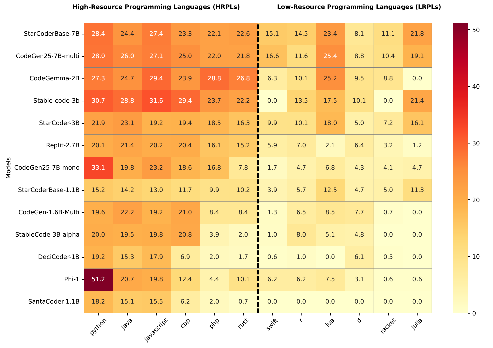

# Survey-CodeLLM4LowResource-DSL
<div align="center">

[](https://arxiv.org/pdf/2410.03981v3)
[](https://github.com/username/Survey-CodeLLM4LowResource-DSL)
[](https://opensource.org/licenses/MIT)
[](http://makeapullrequest.com)
[]()

</div>

This repository contains resources referenced in the paper: [A Survey on LLM-based Code Generation for Low-Resource and Domain-Specific Programming Languages](https://arxiv.org/pdf/2410.03981).

---

## 🔥 What's New

- **[2025]** 📄 Survey paper is accepted at ACM Transactions on Software Engineering and Methodology (TOSEM)
- **[2024]** 📄 Survey paper submitted: "A Survey on LLM-based Code Generation for Low-Resource and Domain-Specific Programming Languages"
- **[2024]** 📊 Comprehensive analysis of 111 papers covering 40+ programming languages

## 📖 Overview

Large Language Models (LLMs) have shown remarkable capabilities in code generation for popular programming languages. However, their performance in **Low-Resource Programming Languages (LRPLs)** and **Domain-Specific Languages (DSLs)** remains a critical challenge. 

Our survey provides a **systematic review of 111 papers** filtered from over 27,000 published studies from 2020-2024, investigating the capabilities and limitations of LLMs in these specialized domains. We identify four main evaluation techniques, categorize enhancement methods into six groups, and analyze dataset curation approaches for LRPLs and DSLs.

<div align="center">



*Figure 1: Performance comparison between High-Resource Programming Languages (HRPLs) and Low-Resource Programming Languages (LRPLs) on the MultiPL-E benchmark. The heatmap shows significant performance disparities, between for example, Python and Rust.*

</div>


### Research Questions

Our systematic investigation addresses three key research questions:

#### **RQ1: Which LLMs, Metrics and Benchmarks are used to evaluate code generation in LRPL and DSL Domains?**

LLMs have been widely used for code generation with many models appearing on leaderboards, but most research focuses on popular languages dominated by Python. It is not clear which LLMs have been used for LRPLs and DSLs, and what evaluation metrics and benchmark datasets are used for these languages. Understanding this information helps assess LLM capabilities and identify whether new metrics are needed for LRPLs and DSLs.

#### **RQ2: What strategies and methodologies have been proposed in the literature to enhance the performance of LLMs for code generation in LRPLs and DSLs?**

Enhancing LLM performance in LRPL and DSL settings is essential for bridging capability gaps that prevent significant developer populations from leveraging AI-assisted coding tools. Specialized domains and resource-constrained languages present unique challenges, such as limited training data and highly specialized syntax, which general-purpose LLMs may not effectively address. Understanding proposed strategies and methodologies is crucial for identifying effective approaches and guiding future research.

#### **RQ3: How are datasets for LRPLs and DSLs collected, processed, and utilized to support code generation tasks using LLMs?**

High-quality datasets are fundamental to training LLMs for code generation tasks. However, LRPLs and DSLs often suffer from data scarcity and imbalance, which can significantly hinder LLM performance. Understanding the methodologies employed to collect, process, and utilize datasets for these specialized languages is critical for addressing data-related challenges and ensuring LLMs can generate accurate and reliable code.


### 🎯 Key Contributions

- **Comprehensive Literature Review (RQ1)**: Systematic analysis of 111 papers filtered from 27,000+ studies (2020-2024)
- **LLM & Evaluation Analysis (RQ1)**: Identification of models, metrics, and benchmarks used across LRPL/DSL domains
- **Enhancement Methodology Taxonomy (RQ2)**: Six categories of techniques with effectiveness analysis
- **Dataset Curation Analysis (RQ3)**: Comprehensive review of data collection, processing, and utilization strategies
- **Performance Gap Analysis**: Quantitative comparison showing significant disparities between HRPLs and LRPLs/DSLs
- **Research Roadmap**: Identification of challenges and opportunities for future research directions


## 📊 Survey Statistics

| **Metric** | **Count** |
|------------|-----------|
| Total Papers Reviewed | 111 |
| Initial Paper Pool | 27,000+ |
| Time Period | 2020-2024 |
| Programming Languages | 40+ |
| Research Venues | 39 |
| LRPL Papers | 51 |
| DSL Papers | 59 |
| Both LRPL & DSL | 1 |

## 🛠️ Enhancement Techniques Analysis (RQ2)

### Techniques Distribution (from Figure 3a in survey)
| Technique | Paper Count |
|-----------|-------------|
| **Fine-tuning** | 48 |
| **Prompting Strategies** | 25 |
| **Pre-training** | 22 |
| **Iterative Feedback** | 11 |
| **RAG** | 6 |
| **Decoding** | 5 |
| **DSL Creation** | 4 |
| **Novel Architectures** | 3 |
| **Knowledge Distillation** | 2 |

### Base Models Used for Fine-tuning (from Figure 3b in survey)
| Model Family | Usage Count |
|--------------|-------------|
| **LLaMA Family** | 14 |
| **DeepSeek Family** | 10 |
| **StarCoder Family** | 9 |
| **CodeGen** | 6 |
| **CodeQwen** | 4 |
| **T5** | 3 |
| **Mistral** | 3 |
| **CodeT5** | 3 |
| **CodeGPT** | 2 |
| **GPT-2** | 2 |
| **CodeGeeX** | 2 |
| **Others** | 18 |

### Performance Improvement Examples (from Table 7 in survey)
| Paper | Benchmark | Lang. | Model | Metric | Base | Finetuned |
|-------|-----------|-------|-------|--------|------|-----------|
| [128] | HumanEval | Rust | Starcoder | pass@1 | 21.8 | 23.4 |
| [85] | Regex-turk | Regex | T5 | acc. | 58.0 | 64.2 |
| [85] | FOL-mnli | FOL | T5 | acc. | 46.9 | 53.9 |
| [85] | FOL-codesc | FOL | T5 | acc. | 58.6 | 59.0 |
| [85] | LTL-synthesis | LTL | T5 | acc. | 87.5 | 87.9 |
| [187] | MultiPL-E | Rust | CodeLLaMA-PY | pass@1 | 27.0 | 40.3 |
| [176] | HumanEval-Haskell | Haskell | CodeGPT | ExMatch | 23.2 | 40.0 |
| [19] | Thakur-et-al. | Verilog | LLaMA2 | pass@5 | 41.2 | 70.6 |
| [15] | MCEval | Rust | CodeQwen-1.5 | pass@1 | 47.2 | 67.9 |
| [64] | HumanEval-Kotlin | Kotlin | CodeLLAMA | pass@1 | 26.1 | 42.2 |
| [64] | HumanEval-KOTLIN | Kotlin | DeepSeek | pass@1 | 41.0 | 55.3 |

## 📊 Evaluation Metrics & Benchmarks (RQ1)

### Commonly Used Automatic Evaluation Metrics (from Table 3 in survey)

| Metrics | Languages | Papers |
|---------|-----------|--------|
| **pass@k** | Awk, Bash, Codon, CoffeeScript, Crystal, D, Dart, Elixir, Erlang, Fortran, Go, Groovy, Haskell, Julia, Kotlin, Lean, Lua, Nim, OCaml, Pascal, Perl, PHP, PowerShell, R, Racket, Ruby, Rust, Scala, Scheme, Swift, Tcl, Verilog, VHDL, Vim script, F#, Terraform | [6, 13–15, 19, 25, 30, 41, 47, 62, 64, 78, 80, 102, 113, 114, 128, 130, 131, 137, 140, 142, 143, 149, 170, 177, 187, 192, 193, 208, 210, 215] [103, 205] |
| **BLEU** | Ansible, Assembly, Bash, Codon, Crystal, CQL, D, Fortran, GitHub Actions YAML, Haskell, Kotlin, LLVM IR, Nim, PowerShell, Ruby, Rust, Scala, Swift, Verilog | [26, 53, 92, 107, 109, 140, 148, 162, 195, 199, 207, 215] |
| **ROUGE** | Assembly, Codon, Crystal, D, Fortran, Haskell, Julia, Kotlin, Lua, Nim, PowerShell, R, Ruby, Rust, Scala, Swift | [13, 92, 109, 140, 195] |
| **Edit Similarity** | Kotlin, Rust, Scala, Ruby, Haskell, Bash | [92, 109, 162, 176] |
| **Exact Match** | Kotlin, Rust, Scala, Ruby, Regex, FOL, LTL, Ansible, Assembly, LLVM IR, CAD, Haskell, R, OCL, CQL, Bash, YAML | [2, 26, 53, 85, 92, 125, 139, 146, 148, 174, 176, 195, 215] |
| **METEOR** | Kotlin, Rust, Scala, Ruby, Assembly, PowerShell | [92, 109, 195] |

### Domain-Specific Evaluation Metrics (from Table 4 in survey)

| Metric | Language(s) | Papers |
|--------|-------------|--------|
| **Ansible Aware Metric** | Ansible | [146, 148] |
| **Schema Correct Metric** | Ansible | [146, 148] |
| **Command Accuracy (CMD Acc)** | Bash | [146, 215] |
| **Accuracy per Sequence** | Multiple | [85] |
| **Semantic Accuracy** | Regex | [85, 115] |
| **Pass@(scenario)** | Verilog | [170] |
| **Syn-VCS, Syn-DC** | Verilog | [114] |
| **Power-Performance-Area (PPA)** | Verilog | [50, 117, 122, 172] |
| **Execution Accuracy** | Bash, CQL | [53, 179] |
| **Logical Equivalence (LE)** | FOL | [199] |
| **Verify@k** | F* | [16] |

### Major Benchmarks (from Table 5 in survey)

| Benchmark Name | Languages | Papers | Research Utilization |
|----------------|-----------|--------|---------------------|
| **MultiPL-E** | Bash, Lua, Perl, R, Ruby, Racket, D, Go, Julia, Rust, Scala, Swift | [13, 14, 57, 137, 140, 187, 188, 190] [205] | Cross-language comparison; knowledge transfer studies |
| **xCodeEval** | Kotlin, Ruby, Rust | [102] | LRPL-focused evaluation; executable code testing |
| **BabelCode** | Dart, Lua, Rust, C#, R, Julia, and Haskell | [137] | Language diversity studies; syntax transfer analysis |
| **VerilogEval** | Verilog | [25, 78, 80, 113, 114, 130, 142, 149, 172, 177, 208, 210] | Standard Verilog benchmark; hardware LLM evaluation |
| **RTLLM** | Verilog | [19, 25, 78, 114, 117, 172, 210] | Hardware design; RTL generation |
| **TLDR** | Bash | [146, 215] | Command generation; system administration |
| **FIMO** | Lean | [41, 191] | Theorem proving; formal math |
| **FOLIO** | FOL | [136, 199] | Natural language to logic; reasoning tasks |

## 📚 Dataset Curation & Processing (RQ3)

### Data Source Categories (from survey analysis)

#### Curated Datasets
| Approach | Description | Example Papers |
|----------|-------------|----------------|
| **Existing Datasets** | Direct use of pre-existing datasets | [176], [136], [165] |
| **Modified Existing Datasets** | Adaptation of existing datasets for specific goals | [146], [195], [196] |
| **Collected Datasets** | Gathering data from various sources | [57], [64], [190] |

#### Data Sources by Type
| Source Type | Examples | Languages | Papers |
|-------------|----------|-----------|--------|
| **Code Repositories** | GitHub, GitLab | Most LRPLs/DSLs | [4, 6, 76, 147, 192] |
| **Educational Resources** | Textbooks, HDLBits, University courses | R, Verilog, Lean | [125], [170], [36], [191] |
| **Programming Contests** | Codeforces, contest platforms | Multiple | [102], [140] |
| **Specialized Sources** | Stack Overflow, Technical forums | Multiple | [28], [57] |

#### Synthetic Data Generation
| Generator Model | Target Languages | Papers | Approach |
|-----------------|------------------|--------|----------|
| **GPT-3.5/4** | Verilog, Kotlin, FOL | [113], [64], [199] | Problem-solution generation |
| **Claude3-Haiku** | Verilog | [25] | Code-to-code augmentation |
| **StarCoder-15B** | Multiple LRPLs | [13] | Cross-language translation |
| **DeepSeek** | Lean | [191] | Quality classification |

### Data Processing Pipeline (from survey Section 6.2)

1. **Initial Filtering**: File extensions, size limits, license compatibility
2. **Deduplication**: MinHash, ROUGE-L based approaches
3. **Fine-grained Filtering**: Syntax validation, domain-specific rules
4. **Code Extraction and Cleaning**: Comment separation, structure preservation
5. **Quality Checks**: Compilation tests, static analysis
6. **Dataset-specific Processing**: Domain adaptations
7. **Decontamination**: Benchmark data removal

## 📋 Complete Paper List by Category

### Low-Resource Programming Languages (LRPLs) - 51 Papers

#### Systems Programming
- **Rust**: 
  - [128] **OctoPack: Instruction tuning code large language models** - *Muennighoff et al., 2023* - [Paper](https://arxiv.org/abs/2308.07124)
  - [30] **Assessing Code Generation with Intermediate Languages** - *Deng et al., 2024* - [Paper](https://arxiv.org/abs/2407.05411)
  - [47] **ReflectionCoder: Learning from Reflection Sequence for Enhanced One-off Code Generation** - *Ren et al., 2024* - [Paper]()
  - [187] **MagiCoder: Empowering Code Generation with OSS-INSTRUCT** - *Wei et al., 2024* - [Paper](https://arxiv.org/abs/2312.02120)
  - [140] **IRCoder: Intermediate Representations Make Language Models Robust Multilingual Code Generators** - *Paul et al., 2024* - [Paper](https://arxiv.org/abs/2403.03894)
  - [176] **Investigating the performance of language models for completing code in functional programming languages: a haskell case study** - *Van Dam et al., 2024* - [Paper](https://arxiv.org/abs/2403.15185)
  - [15] **McEval: Massively Multilingual Code Evaluation** - *Chai et al., 2025* - [Paper](https://arxiv.org/abs/2406.07436)
  - [64] **Kotlin ML Pack: Technical Report** - *Titov et al., 2024* - [Paper](https://arxiv.org/abs/2405.19250)

- **D**: 
  - [140] **IRCoder: Intermediate Representations Make Language Models Robust Multilingual Code Generators** - *Paul et al., 2024* - [Paper](https://arxiv.org/abs/2403.03894)
  - [188] **Batched Low-Rank Adaptation of Foundation Models** - *Wen & Chaudhuri, 2024* - [Paper](https://arxiv.org/abs/2312.05677)
  - [14] **MultiPL-E: A Scalable and Polyglot Approach to Benchmarking Neural Code Generation** - *Cassano et al., 2023* - [Paper](https://arxiv.org/abs/2208.08227)

- **Nim**: 
  - [140] **IRCoder: Intermediate Representations Make Language Models Robust Multilingual Code Generators** - *Paul et al., 2024* - [Paper](https://arxiv.org/abs/2403.03894)

- **Crystal**: 
  - [140] **IRCoder: Intermediate Representations Make Language Models Robust Multilingual Code Generators** - *Paul et al., 2024* - [Paper](https://arxiv.org/abs/2403.03894)

#### Mobile & Cross-Platform
- **Swift**: 
  - [6] **Multi-lingual evaluation of code generation models** - *Athiwaratkun et al., 2023* - [Paper](https://arxiv.org/abs/2210.14868)
  - [140] **IRCoder: Intermediate Representations Make Language Models Robust Multilingual Code Generators** - *Paul et al., 2024* - [Paper](https://arxiv.org/abs/2403.03894)
  - [14] **MultiPL-E: A Scalable and Polyglot Approach to Benchmarking Neural Code Generation** - *Cassano et al., 2023* - [Paper](https://arxiv.org/abs/2208.08227)
  - [143] **HumanEval-XL: A Multilingual Code Generation Benchmark** - *Peng et al., 2024* - [Paper](https://arxiv.org/abs/2402.16694)

- **Dart**: 
  - [137] **Measuring the impact of programming language distribution** - *Orlanski et al., 2023* - [Paper](https://arxiv.org/abs/2302.01973)

- **Kotlin**: 
  - [6] **Multi-lingual evaluation of code generation models** - *Athiwaratkun et al., 2023* - [Paper](https://arxiv.org/abs/2210.14868)
  - [64] **Kotlin ML Pack: Technical Report** - *Titov et al., 2024* - [Paper]()
  - [92] **Language models for code completion: A practical evaluation** - *Izadi et al., 2024* - [Paper](https://arxiv.org/abs/2402.16197)
  - [102] **XCodeEval: An Execution-based Large Scale Multilingual Multitask Benchmark** - *Khan et al., 2024* - [Paper](https://arxiv.org/abs/2303.03004)
  - [143] **HumanEval-XL: A Multilingual Code Generation Benchmark** - *Peng et al., 2024* - [Paper](https://arxiv.org/abs/2402.16694)

#### Scripting & Automation
- **Ruby**: 
  - [6] **Multi-lingual evaluation of code generation models** - *Athiwaratkun et al., 2023* - [Paper](https://arxiv.org/abs/2210.14868)
  - [82] **MultiCoder: Multi-Programming-Lingual Pre-Training for Low-Resource Code Completion** - *Gong et al., 2022* - [Paper](https://arxiv.org/abs/2212.09666)
  - [92] **Language models for code completion: A practical evaluation** - *Izadi et al., 2024* - [Paper](https://arxiv.org/abs/2402.16197)
  - [102] **XCodeEval: An Execution-based Large Scale Multilingual Multitask Benchmark** - *Khan et al., 2024* - [Paper](https://arxiv.org/abs/2303.03004)
  - [14] **MultiPL-E: A Scalable and Polyglot Approach to Benchmarking Neural Code Generation** - *Cassano et al., 2023* - [Paper](https://arxiv.org/abs/2208.08227)

- **Perl**: 
  - [6] **Multi-lingual evaluation of code generation models** - *Athiwaratkun et al., 2023* - [Paper](https://arxiv.org/abs/2210.14868)
  - [188] **Batched Low-Rank Adaptation of Foundation Models** - *Wen & Chaudhuri, 2024* - [Paper](https://arxiv.org/abs/2312.05677)
  - [143] **HumanEval-XL: A Multilingual Code Generation Benchmark** - *Peng et al., 2024* - [Paper](https://arxiv.org/abs/2402.16694)

- **Lua**: 
  - [13] **Knowledge transfer from high-resource to low-resource programming languages for code llms** - *Cassano et al., 2024* - [Paper](https://arxiv.org/abs/2308.09895)
  - [14] **MultiPL-E: A Scalable and Polyglot Approach to Benchmarking Neural Code Generation** - *Cassano et al., 2023* - [Paper](https://arxiv.org/abs/2208.08227)
  - [137] **Measuring the impact of programming language distribution** - *Orlanski et al., 2023* - [Paper](https://arxiv.org/abs/2302.01973)

- **PowerShell**: 
  - [109] **The Power of Words: Generating PowerShell Attacks from Natural Language** - *Liguori et al., 2024* - [Paper](https://dl.acm.org/doi/10.5555/3696933.3696937)
  - [191] **Advancing Theorem Proving in LLMs through Large-Scale Synthetic Data** - *Xin et al., 2024* - [Paper](https://arxiv.org/abs/2405.14333)

#### Functional Programming
- **Haskell**: 
  - [137] **Measuring the impact of programming language distribution** - *Orlanski et al., 2023* - [Paper](https://arxiv.org/abs/2302.01973)
  - [140] **IRCoder: Intermediate Representations Make Language Models Robust Multilingual Code Generators** - *Paul et al., 2024* - [Paper](https://arxiv.org/abs/2403.03894)
  - [176] **Investigating the performance of language models for completing code in functional programming languages: a haskell case study** - *Van Dam et al., 2024* - [Paper](https://arxiv.org/abs/2403.15185)

- **Scala**: 
  - [92] **Language models for code completion: A practical evaluation** - *Izadi et al., 2024* - [Paper](https://arxiv.org/abs/2402.16197)
  - [102] **XCodeEval: An Execution-based Large Scale Multilingual Multitask Benchmark** - *Khan et al., 2024* - [Paper](https://arxiv.org/abs/2303.03004)
  - [14] **MultiPL-E: A Scalable and Polyglot Approach to Benchmarking Neural Code Generation** - *Cassano et al., 2023* - [Paper](https://arxiv.org/abs/2208.08227)
  - [143] **HumanEval-XL: A Multilingual Code Generation Benchmark** - *Peng et al., 2024* - [Paper](https://arxiv.org/abs/2402.16694)

- **Racket**: 
  - [13] **Knowledge transfer from high-resource to low-resource programming languages for code llms** - *Cassano et al., 2024* - [Paper](https://arxiv.org/abs/2308.09895)
  - [14] **MultiPL-E: A Scalable and Polyglot Approach to Benchmarking Neural Code Generation** - *Cassano et al., 2023* - [Paper](https://arxiv.org/abs/2208.08227)

- **OCaml**: 
  - [13] **Knowledge transfer from high-resource to low-resource programming languages for code llms** - *Cassano et al., 2024* - [Paper](https://arxiv.org/abs/2308.09895)

#### Scientific Computing
- **R**: 
  - [13] **Knowledge transfer from high-resource to low-resource programming languages for code llms** - *Cassano et al., 2024* - [Paper](https://arxiv.org/abs/2308.09895)
  - [14] **MultiPL-E: A Scalable and Polyglot Approach to Benchmarking Neural Code Generation** - *Cassano et al., 2023* - [Paper](https://arxiv.org/abs/2208.08227)
  - [33] **GenCodeSearchNet: A Benchmark Test Suite for Evaluating Generalization in Programming Language Understanding** - *Diera et al., 2023* - [Paper](https://arxiv.org/abs/2311.09707)
  - [125] **User Centric Evaluation of Code Generation Tools** - *Miah & Zhu, 2024* - [Paper](https://arxiv.org/abs/2402.03130)
  - [147] **Time-Efficient Code Completion Model for the R Programming Language** - *Popov et al., 2021* - [Paper](https://aclanthology.org/2021.nlp4prog-1.4/)
  - [118] **Python is Not Always the Best Choice: Embracing Multilingual Program of Thoughts** - *Luo et al., 2024* - [Paper](https://aclanthology.org/2024.emnlp-main.408/)

- **Julia**: 
  - [12] **A Comparative Study of Code Generation using ChatGPT 3.5 across 10 Programming Languages** - *Buscemi, 2023* - [Paper](https://arxiv.org/abs/2308.04477)
  - [79] **Evaluation of openai codex for hpc parallel programming models kernel generation** - *Godoy et al., 2023* - [Paper](https://arxiv.org/abs/2306.15121)
  - [137] **Measuring the impact of programming language distribution** - *Orlanski et al., 2023* - [Paper](https://arxiv.org/abs/2302.01973)
  - [14] **MultiPL-E: A Scalable and Polyglot Approach to Benchmarking Neural Code Generation** - *Cassano et al., 2023* - [Paper](https://arxiv.org/abs/2208.08227)

- **Fortran**: 
  - [66] **Scope is all you need: Transforming LLMs for HPC Code** - *Kadosh et al., 2023* - [Paper](https://arxiv.org/abs/2308.09440)
  - [79] **Evaluation of openai codex for hpc parallel programming models kernel generation** - *Godoy et al., 2023* - [Paper](https://arxiv.org/abs/2306.15121)
  - [140] **IRCoder: Intermediate Representations Make Language Models Robust Multilingual Code Generators** - *Paul et al., 2024* - [Paper](https://arxiv.org/abs/2403.03894)
  - [159] **S3LLM: Large-Scale Scientific Software Understanding with LLMs** - *Shaik et al., 2024* - [Paper](https://arxiv.org/abs/2403.10588)

#### Shell & Command Line
- **Bash**: 
  - [146] **DocCGen: Document-based Controlled Code Generation** - *Pimparkhede et al., 2024* - [Paper](https://arxiv.org/abs/2406.11925)
  - [162] **ShellGPT: Generative Pre-trained Transformer Model for Shell Language Understanding** - *Shi et al., 2023* - [Paper](https://ieeexplore.ieee.org/document/10301251)
  - [179] **Tackling Execution-Based Evaluation for NL2Bash** - *Vo et al., 2024* - [Paper](https://arxiv.org/abs/2405.06807)
  - [196] **InterCode: standardizing and benchmarking interactive coding with execution feedback** - *Yang et al., 2023* - [Paper](https://arxiv.org/abs/2306.14898)
  - [215] **DocPrompting: Generating Code by Retrieving the Docs** - *Zhou et al., 2023* - [Paper](https://arxiv.org/abs/2207.05987)

### Domain-Specific Languages (DSLs) - 59 Papers

#### Hardware Description Languages (25 papers)
- **Verilog**: 
  - [19] **Data is all you need: Finetuning llms for chip design via an automated design-data augmentation framework** - *Chang et al., 2024* - [Paper](https://dl.acm.org/doi/10.1145/3649329.3657356)
  - [25] **Origen: Enhancing rtl code generation with code-to-code augmentation and self-reflection** - *Cui et al., 2024* - [Paper](https://dl.acm.org/doi/10.1145/3676536.3676830)
  - [78] **Autovcoder: A systematic framework for automated verilog code generation using llms** - *Gao et al., 2024* - [Paper](https://arxiv.org/abs/2407.18333)
  - [80] **From English to ASIC: Hardware Implementation with Large Language Model** - *Goh et al., 2024* - [Paper](https://arxiv.org/abs/2403.07039)
  - [113] **Verilogeval: Evaluating large language models for verilog code generation** - *Liu et al., 2023* - [Paper](https://arxiv.org/abs/2309.07544)
  - [114] **RTLCoder: Outperforming GPT-3.5 in Design RTL Generation** - *Liu et al., 2024* - [Paper](https://arxiv.org/abs/2312.08617)
  - [117] **Rtllm: An open-source benchmark for design rtl generation with large language model** - *Lu et al., 2024* - [Paper](https://arxiv.org/abs/2308.05345)
  - [130] **A multi-expert large language model architecture for verilog code generation** - *Nadimi & Zheng, 2024* - [Paper](https://arxiv.org/abs/2404.08029)
  - [142] **BetterV: controlled verilog generation with discriminative guidance** - *Pei et al., 2024* - [Paper](https://dl.acm.org/doi/10.5555/3692070.3693698)
  - [149] **AutoBench: Automatic Testbench Generation and Evaluation Using LLMs for HDL Design** - *Qiu et al., 2024* - [Paper](https://dl.acm.org/doi/10.1145/3670474.3685956)
  - [170] **Benchmarking large language models for automated verilog rtl code generation** - *Thakur et al., 2023* - [Paper](https://arxiv.org/abs/2212.11140)
  - [172] **Advanced Large Language Model (LLM)-Driven Verilog Development** - *Thorat et al., 2023* - [Paper](https://arxiv.org/abs/2312.01022)
  - [177] **VHDLEval: A Framework for Evaluating Large Language Models in VHDL Code Generation** - *Vijayaraghavan et al., 2024* - [Paper](https://arxiv.org/abs/2406.04379)
  - [208] **MG-Verilog: Multi-grained Dataset Towards Enhanced LLM-assisted Verilog Generation** - *Zhang et al., 2024* - [Paper](https://arxiv.org/abs/2407.01910)
  - [210] **CodeV: Empowering LLMs for Verilog Generation through Multi-Level Summarization** - *Zhao et al., 2024* - [Paper](https://arxiv.org/abs/2407.10424)

- **VHDL**: 
  - [177] **VHDLEval: A Framework for Evaluating Large Language Models in VHDL Code Generation** - *Vijayaraghavan et al., 2024* - [Paper](https://arxiv.org/abs/2406.04379)

- **System Verilog**: 
  - [75] **Hardware phi-1.5 b: A large language model encodes hardware domain specific knowledge** - *Fu et al., 2024* - [Paper](https://arxiv.org/abs/2402.01728)
  - [99] **(Security) Assertions by Large Language Models** - *Kande et al., 2024* - [Paper](https://ieeexplore.ieee.org/document/10458667)
  - [121] **Chiraag: Chatgpt informed rapid and automated assertion generation** - *Mali et al., 2024* - [Paper](https://arxiv.org/abs/2402.00093)
  - [194] **AssertLLM: Generating Hardware Verification Assertions from Design Specifications via Multi-LLMs** - *Yan et al., 2025***:  - [Paper](https://arxiv.org/abs/2402.00386)

#### Infrastructure & Automation (7 papers)
- **Ansible**: 
  - [132] **KubePlaybook: A Repository of Ansible Playbooks for Kubernetes Auto-Remediation with LLMs** - *Namrud et al., 2024* - [Paper](https://dl.acm.org/doi/10.1145/3629527.3653665)
  - [146] **DocCGen: Document-based Controlled Code Generation** - *Pimparkhede et al., 2024* - [Paper](https://aclanthology.org/2024.emnlp-main.1040/)
  - [148] **Automated Code Generation for Information Technology Tasks in YAML through Large Language Models** - *Pujar et al., 2025* - [Paper](https://arxiv.org/abs/2305.02783)
  - [154] **Ansible lightspeed: A code generation service for it automation** - *Sahoo et al., 2024* - [Paper](https://arxiv.org/abs/2402.17442)

- **YAML**: 
  - [207] **On the effectiveness of large language models for github workflows** - *Zhang et al., 2024* - [Paper](https://arxiv.org/abs/2403.12446)

- **Terraform HCL**: 
  - [103] **Iac-eval: A code generation benchmark for cloud infrastructure-as-code programs** - *Kon et al., 2024* - [Paper](https://proceedings.neurips.cc/paper_files/paper/2024/file/f26b29298ae8acd94bd7e839688e329b-Paper-Datasets_and_Benchmarks_Track.pdf)

#### Formal Methods & Verification (10 papers)
- **Lean**: 
  - [36] **Towards a Mathematics Formalisation Assistant using Large Language Models** - *Agrawal et al., 2022* - [Paper](https://arxiv.org/abs/2211.07524)
  - [41] **FIMO: A Challenge Formal Dataset for Automated Theorem Proving** - *Liu et al., 2023* - [Paper](https://arxiv.org/abs/2309.04295)
  - [191] **Advancing Theorem Proving in LLMs through Large-Scale Synthetic Data** - *Xin et al., 2024* - [Paper](https://arxiv.org/abs/2405.14333)

- **Coq**: 
  - [74] **Enhancing Formal Theorem Proving: A Comprehensive Dataset for Training AI Models on Coq Code** - *Florath, 2024* - [Paper](https://arxiv.org/abs/2403.12627)

- **F***: 
  - [16] **Towards Neural Synthesis for SMT-Assisted Proof-Oriented Programming** - *Chakraborty et al., 2025* - [Paper](https://arxiv.org/abs/2405.01787)

- **Verus**: 
  - [200] **Leveraging Large Language Models for Automated Proof Synthesis in Rust** - *Yao et al., 2023* - [Paper](https://arxiv.org/abs/2311.03739)

- **UCLID5**: 
  - [126] **Synthetic programming elicitation for text-to-code in very low-resource programming and formal languages** - *Mora et al., 2024* - [Paper](https://arxiv.org/abs/2406.03636)

#### Logic & Specification Languages (8 papers)
- **FOL**: 
  - [85] **Formal Specifications from Natural Language** - *Hahn et al., 2022* - [Paper](https://arxiv.org/abs/2206.01962)
  - [136] **LINC: A Neurosymbolic Approach for Logical Reasoning by Combining Language Models with First-Order Logic Provers** - *Olausson et al., 2023* - [Paper](https://arxiv.org/abs/2310.15164)
  - [199] **Harnessing the Power of Large Language Models for Natural Language to First-Order Logic Translation** - *Yang et al., 2024* - [Paper](https://arxiv.org/abs/2305.15541)

- **LTL**: 
  - [24] **nl2spec: Interactively translating unstructured natural language to temporal logics with large language models** - *Cosler et al., 2023* - [Paper](https://arxiv.org/abs/2303.04864)
  - [85] **Formal Specifications from Natural Language** - *Hahn et al., 2022* - [Paper](https://arxiv.org/abs/2206.01962)

- **Regex**: 
  - [85] **Formal Specifications from Natural Language** - *Hahn et al., 2022* - [Paper](https://arxiv.org/abs/2206.01962)
  - [115] **Neural Generation of Regular Expressions from Natural Language with Minimal Domain Knowledge** - *Locascio et al., 2016* - [Paper](https://arxiv.org/abs/1608.03000)

#### Scientific & Specialized Domains (9 papers)
- **Excel Formulas**: 
  - [97] **Flame: A small language model for spreadsheet formulas** - *Joshi et al., 2024* - [Paper](https://arxiv.org/abs/2301.13779)

- **CAD Sketches**: 
  - [139] **Sketchgen: Generating constrained cad sketches** - *Para et al., 2021* - [Paper](https://arxiv.org/abs/2106.02711)

- **XDL (Chemistry)**: 
  - [165] **Errors are Useful Prompts: Instruction Guided Task Programming with Verifier-Assisted Iterative Prompting** - *Skreta et al., 2023* - [Paper](https://arxiv.org/abs/2303.14100)

- **PDDL**: 
  - [166] **Generating consistent PDDL domains with Large Language Models** - *Smirnov et al., 2024* - [Paper](https://arxiv.org/abs/2404.07751)
  - [180] **Grammar prompting for domain-specific language generation with large language models** - *Wang et al., 2023* - [Paper](https://arxiv.org/abs/2305.19234)

- **SMILES**: 
  - [180] **Grammar prompting for domain-specific language generation with large language models** - *Wang et al., 2023* - [Paper](https://arxiv.org/abs/2305.19234)

## 📞 Contact
- **Sathvik Joel**
  - 📧 [ksjoe30@gmail.com](mailto:ksjoe30@gmail.com)

- **Jie JW Wu** (Repo Maintainer)
  - 📧 [jie.jw.wu@ubc.ca](mailto:jie.jw.wu@acm.org)

- **Fatemeh Fard** 
  - 📧 [fatemeh.fard@ubc.ca](mailto:fatemeh.fard@ubc.ca)  

## 📜 Citation  

```bibtex
@article{joel2024survey,
  title={A survey on llm-based code generation for low-resource and domain-specific programming languages},
  author={Joel, Sathvik and Wu, Jie JW and Fard, Fatemeh H},
  journal={arXiv preprint arXiv:2410.03981},
  year={2024}
}
```

<div align="center">

**🌟 If you find this survey useful, please give it a star! 🌟**


---

*Last updated: 2025*

</div>
